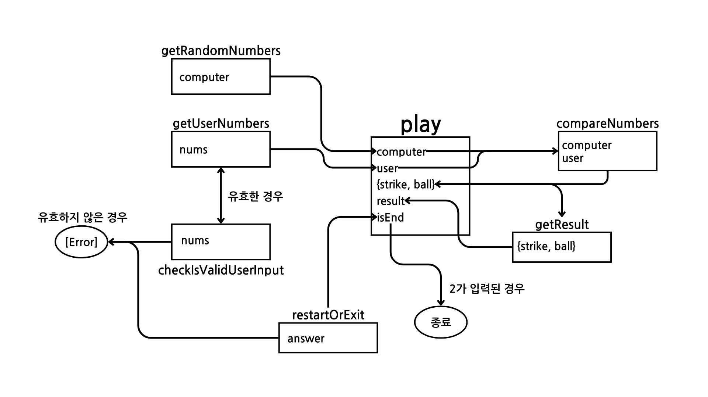

## 체크 리스트

-   [x] 기능 요구 사항 목록 작성
-   [x] 출력값 형식 확인
-   [x] Node.js 18.17.1 버전 확인 -> 20.11.0 버전이므로 가능하다고 판단
-   [x] [Javascript 컨벤션](https://github.com/woowacourse/woowacourse-docs/tree/main/styleguide/javascript) 지키기
-   [x] `process.exit()` 호출 X

## 기능 요구 사항

-   [x] 숫자 야구 시작 문구 출력 (`Console.print`)
-   [x] 컴퓨터가 1~9 까지 서로 다른 임의의 수 3개 선택 (`Random.pickNumberInRange`)
-   [x] 플레이어의 입력값 받기 (`await Console.readLineAsync`)
-   [x] 사용자가 잘못된 값을 입력한 경우 예외 발생 후 종료 (숫자가 아닌 경우, 0인 경우, 길이가 3이 아닌 경우, 입력값 세 자리가 모두 서로 다르지 않을 경우)
-   [x] 플레이어가 입력한 값과 컴퓨터의 값을 비교한다.
-   [x] 같은 수가 같은 자리에 있으면 "스트라이크"
-   [x] 같은 수가 다른 자리에 있으면 "볼"
-   [x] 같은 수가 전혀 없으면 "낫싱"
-   [x] 결과 출력
-   [x] 3스트라이크일 경우 종료 문구 출력
-   [x] 재시작/종료 여부 묻기 (이때도 사용자 입력 예외처리 하기)
-   [x] 아닐 경우 플레이어 입력값 받기부터 다시 반복

-   사용자가 입력한 숫자가 세 자리 모두 서로 다르지 않을 경우도 예외로 처리해야 할까?
    -> Yes, 왜냐하면 사용자가 컴퓨터가 123이고 사용자가 111일때 올바른 결과는 1스트라이크가 맞지만, 중복된 수를 허용할 경우 2볼 1스트라이크가 출력됨.

## Airbnb Javascript naming convention

1. 한 글자 네이밍 피하기. 최대한 뜻을 전달할 수 있는 이름으로 네이밍 하기
2. 변수, 함수는 camelCase 사용
3. 상수는 SNAKE_CASE 사용
4. 생성자 함수, 클래스는 PascalCase 사용
5. 변수명에 언더스코어('\_') 사용 금지
6. this를 별도의 변수에 저장하는 대신 arrow function(또는 function.bind)을 사용해서 this 호출하기
7. default export로 내보내는 식별자와 파일명은 일치시킨다.
8. 약어는 모두 대문자 혹은 소문자로 일치시킨다.

## 라이브러리

`@woowacourse/mission-utils`의 `Random` 및 `Console` API를 사용하여 구현해야 한다.
Random 값 추출: `Random.pickNumberInRange()`
사용자 입력: `Console.readLineAsync`
출력: `Console.print`

## 배운점

-   `NaN`을 `typeof` 로 확인하면 `'number'`가 나오기 때문에 NaN도 숫자로 인식한다.
    이를 방지하려면 `isNaN()` 함수를 사용하면 된다.
